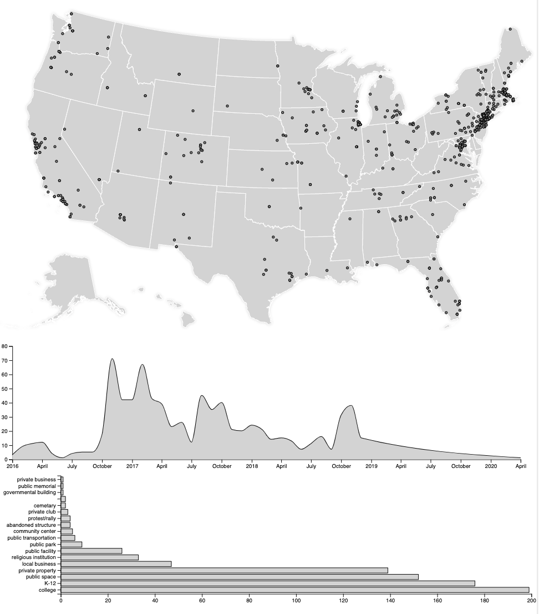

# Swastika Monitor

The Swastika Monitor is an online swastika tracking project to identify the locations in which swastikas have surfaced since 2016. The dataset was curated and labeled by two researchers Laurie Gries (University of Colorado Boulder) and Kelly Wheeler (University of Michigan). The full version of the data is accessible here. This repository was created by research assistant Brandon Daniels, which serves to visualize some aspects of the dataset. 

Interact with the visualization here: https://brandon-daniels.github.io/Data-Viz-Hate-Map/

I'll use this repository as a tutorial for how I prepared the data and created the visualizations. If you have any questions about my process, contact me! This visualization is not the final word on this rich dataset. The principle investigators went through great pains to compile this dataset and meticulously label the data. I can only visualize some parts of the data, and I hope this will lead to a greater engagement with the full dataset.

## Preparing the data
First, I downloaded the completed dataset which is in an Excel Spreadsheet (.xcxl) file format. The principle investigators included many different sheets and color coding mechanisms to work through the data. But in order to process this effectively, I need the file to be in Comma-Seperated-Values (.csv) file format. After deleting the extra worksheets, I saved the file as a CSV through Microsoft Excel. 

Second, I load the data into a python notebook. I use jupyter-lab installed within an anacdona virtual environment. Download or view the notebook here:
https://github.com/brandon-daniels/Data-Viz-Hate-Map/blob/master/DataMethodology.ipynb

Basically, I intend to create a map with all of cities listed in the dataset visualized spatially. This requires obtaining latitude and longitude coordinates (or the best approximation) for each of the 1338 incidents reported. This processes can be automated thanks to natural language processing tools.

Finally, I clean up the data by dropping columns that I won't be using in my visualization. Again, these columns contain rich descriptions of the incident and while not included in my visualiaztion are useful for the corpus.

## Creating the visualization
I undertook this project to learn basic data science skills, but with a focus on an interactive web experience. While there are many pre-made libraries for generating interactive visualizations through python, I choose to write a custom Javascript webpage using the d3.js library. This required fine tuning every aspect of the visualization, such as how the axises are drawn and the exact color scheme. D3.js, or Data-Driven Documents is a library for manipulating HTML elements based on datasets, and using Javascript and web-browsers to create an interactive user experience for exploring data. The attached webpage contains the full Javscript code, with comments for explaining the basic steps. 
